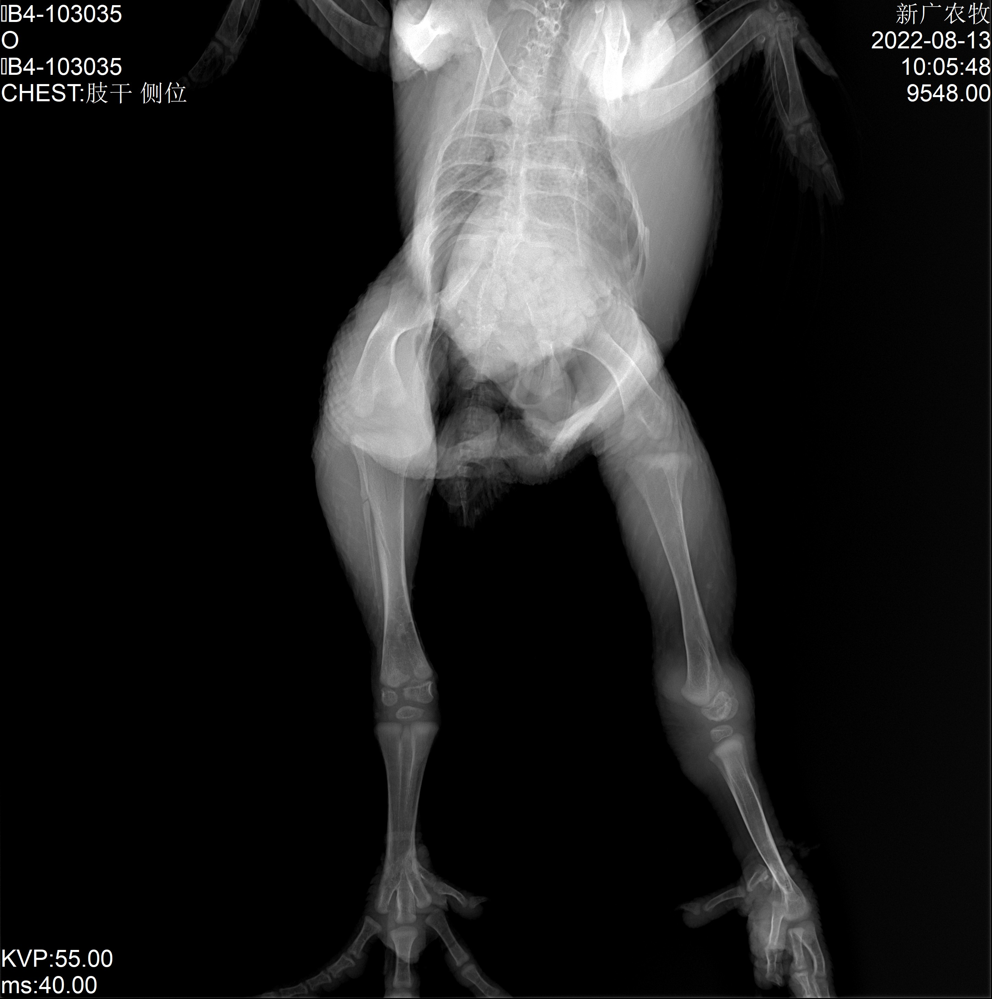

# [chicken-skeletal-form: Scale-Aware Representation Learning for Bottom-Up Chilken Pose Estimation (XXXX 2024)](https://arxiv.org/abs/1908.10357)
## Introduction
This is the official code of [chicken-skeletal-form: Scale-Aware Representation Learning for Bottom-Up Chilken Pose Estimation (XXXX 2024)](https://arxiv.org/abs/1908.10357).  
Bottom-up chicken pose estimation methods have difficulties in predicting the correct pose for small persons due to challenges in scale variation. In this paper, we present **chicken-skeletal base on HigherHRNet**: a novel bottom-up chicken pose estimation method for learning scale-aware representations using high-resolution feature pyramids. Equipped with multi-resolution supervision for training and multi-resolution aggregation  for inference, the proposed approach is able to solve the scale variation challenge in *bottom-up multi-person* pose estimation and localize keypoints more precisely, especially for small person. The feature pyramid in HigherHRNet consists of feature map outputs from HRNet and upsampled higher-resolution outputs through a transposed convolution. HigherHRNet outperforms the previous best bottom-up method by 2.5% AP for medium person on COCO test-dev, showing its effectiveness in handling scale variation. Furthermore, HigherHRNet achieves new state-of-the-art result on COCO test-dev (70.5% AP) without using refinement or other post-processing techniques, surpassing all existing bottom-up methods. HigherHRNet even surpasses all top-down methods on CrowdPose test (67.6% AP), suggesting its robustness in crowded scene. 

